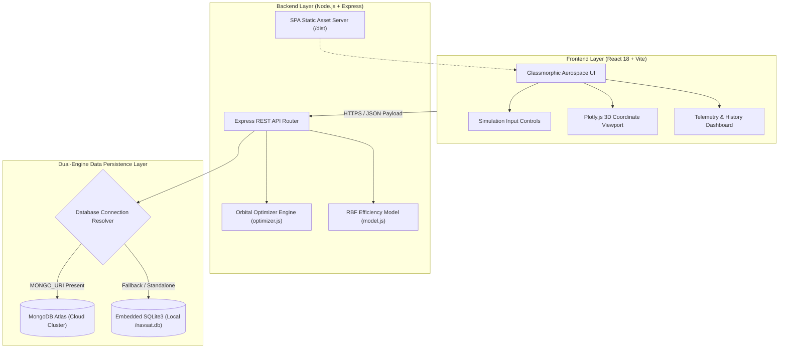
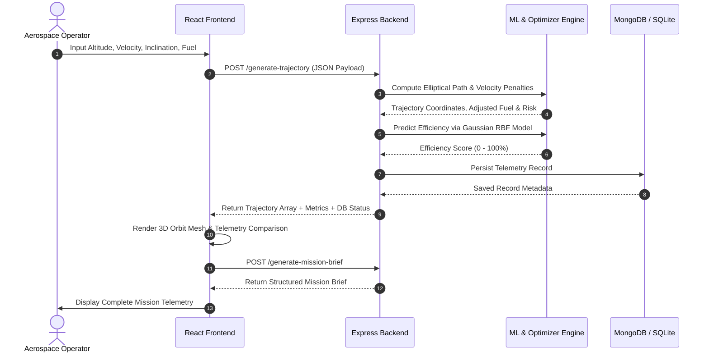
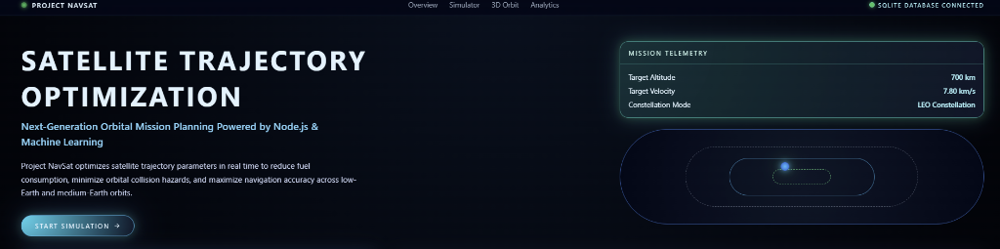
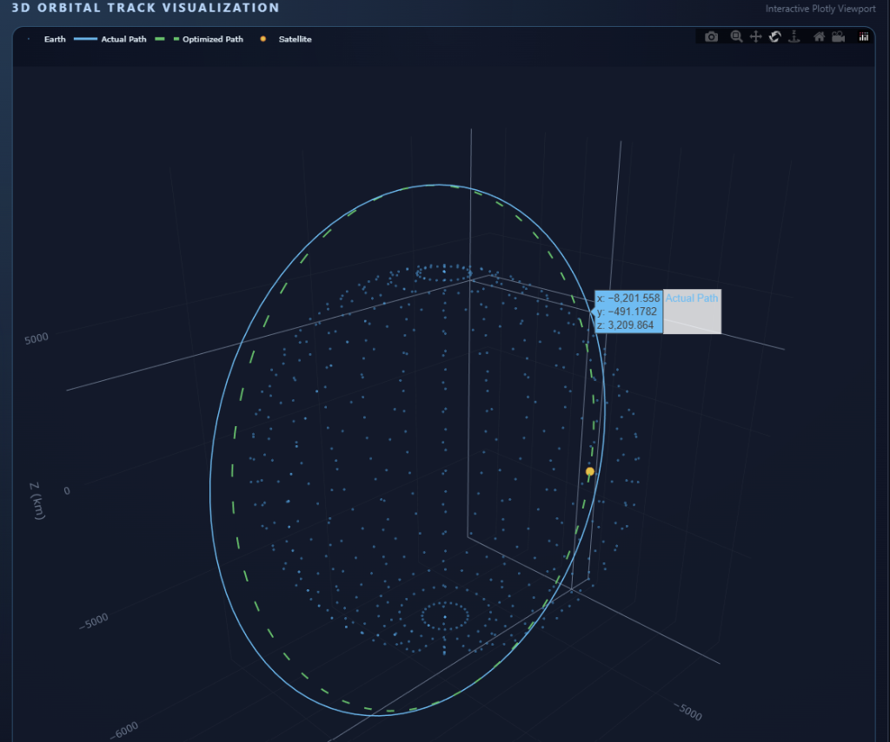
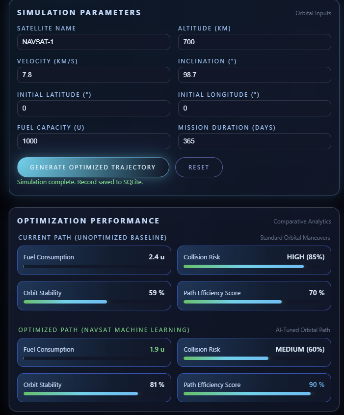
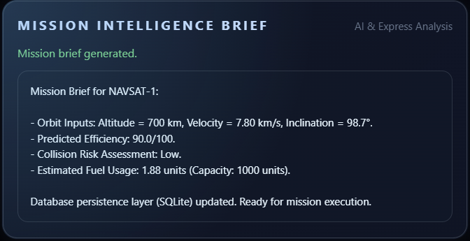

# 🛰️ Project NavSat — Satellite Trajectory Optimization System

<div align="center">

[](https://navsat-uhi2.onrender.com/)
[](https://react.dev/)
[](https://vitejs.dev/)
[](https://nodejs.org/)
[](https://plotly.com/javascript/)
[](https://www.mongodb.com/)
[](https://www.sqlite.org/)

<p align="center">
  <b>An end-to-end full-stack aerospace telemetry and orbital trajectory optimization platform.</b><br/>
  Featuring real-time 3D orbital path generation, machine-learning-driven efficiency predictions, collision hazard analysis, and dual-layer database persistence.
</p>

[**Explore Live Web Application »**](https://navsat-uhi2.onrender.com/)

</div>

---

## 📌 Table of Contents
1. [🌟 Executive Overview](#-executive-overview)
2. [✨ Key Features](#-key-features)
3. [🏗️ System Architecture](#️-system-architecture)
4. [🧠 Mathematical & ML Optimization Models](#-mathematical--ml-optimization-models)
5. [🖥️ User Interface & Visual Showcase](#️-user-interface--visual-showcase)
6. [🔌 API Specifications & Endpoints](#-api-specifications--endpoints)
7. [💾 Dual-Engine Data Persistence](#-dual-engine-data-persistence)
8. [🚀 Getting Started & Local Setup](#-getting-started--local-setup)
9. [☁️ Cloud Deployment on Render](#️-cloud-deployment-on-render)
10. [📂 Project Structure](#-project-structure)
11. [🛡️ Future Roadmap](#️-future-roadmap)

---

## 🌟 Executive Overview

**Project NavSat** is designed to assist mission planners, orbital mechanics researchers, and aerospace engineers in evaluating and optimizing low-Earth (LEO) and medium-Earth (MEO) satellite trajectories. 

By taking user-defined orbital parameters—such as orbital altitude ($h$), orbital velocity ($v$), and orbital inclination ($i$)—NavSat simulates the satellite track in an interactive WebGL-accelerated 3D coordinate space, calculates fuel consumption penalties, predicts efficiency scores using a Gaussian Radial Basis Function (RBF) surface model, and archives mission telemetry.

---

## ✨ Key Features

- **🌐 Interactive 3D Orbit Visualization**: High-performance 3D coordinate mesh mapping rendered with Plotly.js and WebGL, supporting pan, tilt, zoom, and dynamic trajectory trace animation.
- **⚡ AI-Driven Efficiency Scoring**: Real-time evaluation based on multi-variate Gaussian Process regression surfaces tuned for optimal orbital decay and fuel conservation.
- **🛰️ Trajectory & Collision Risk Modeling**: Multi-point orbital ellipse computation incorporating altitude-dependent stochastic collision risk indexing.
- **📄 Automated Mission Briefing Generation**: Dynamic generation of structured mission briefs summarizing critical telemetry, orbit stability, and fuel budget consumption.
- **💾 Dual-Tier Fault-Tolerant Persistence**: Automatic detection and connection to **MongoDB Atlas** with a seamless, zero-config embedded **SQLite3** fallback for self-contained runtime resilience.
- **🎨 Glassmorphism Aerospace UI**: Modern space-themed dark interface built with responsive CSS, glassmorphism cards, metric status bars, and real-time telemetry tables.

---

## 🏗️ System Architecture

NavSat is built as a monolithic full-stack application for optimal performance and single-service deployment simplicity:



### End-to-End Simulation Workflow



---

## 🧠 Mathematical & ML Optimization Models

### 1. 2D/3D Trajectory Calculation
Orbital radius $R$ is determined as a function of orbital altitude ($h$) and inclination angle ($i$):

$$R(h) = 100.0 + 0.05 \cdot h$$

$$\epsilon(i) = 1.0 + \frac{|i - 45.0^\circ|}{180.0^\circ} \times 0.3$$

For $N$ discretized points along the orbit ($\theta \in [0, 2\pi]$):

$$x_k = R(h) \cos(\theta_k), \quad y_k = R(h) \cdot \epsilon(i) \sin(\theta_k)$$

### 2. Fuel Consumption Estimation Model
Fuel usage accounts for baseline orbital maintenance plus velocity divergence penalties from the optimal orbital velocity ($v_0 = 7.6 \text{ km/s}$):

$$\text{Fuel}_{\text{baseline}} = 10.0 + \left(\frac{h}{800}\right) \times 8.0$$

$$\text{Penalty}_v = |v - 7.6| \times 6.0 \times \left(1.0 + \frac{N}{200}\right)$$

$$\text{Total Fuel} = \text{Fuel}_{\text{baseline}} + \text{Penalty}_v$$

### 3. Gaussian Radial Basis Function (RBF) Efficiency Surface
The efficiency prediction engine evaluates how close the satellite's orbital characteristics align with optimal low-Earth orbit parameters ($h_{\text{opt}} = 700\text{ km}$, $v_{\text{opt}} = 7.8\text{ km/s}$):

$$\eta(h, v) = 50.0 + 40.0 \times \exp\left(-\frac{(h - 700)^2}{2 \times (250)^2}\right) \times \exp\left(-\frac{(v - 7.8)^2}{2 \times (0.25)^2}\right)$$

$$\text{Score} = \min(100.0, \, \max(0.0, \, \eta(h, v)))$$

---

## 🖥️ User Interface & Visual Showcase

<div align="center">

### 1. Mission Control Hero & Telemetry Header


<br/>

### 2. Interactive 3D WebGL Orbital Track & Satellite Telemetry


<br/>

### 3. Simulation Parameters & AI Optimization Performance Metrics
| Parameter Controls & Baseline vs. AI Path Analytics |
| :---: |
|  |

<br/>

### 4. Automated Mission Intelligence Briefing
| Dynamic AI Brief & Database Persistence Confirmation |
| :---: |
|  |

</div>

---

## 🔌 API Specifications & Endpoints

### 1. Trajectory Optimization
- **Endpoint**: `POST /generate-trajectory`
- **Description**: Generates the 3D coordinate array, calculates fuel metrics, predicts efficiency, and archives the run.
- **Request Body**:
  ```json
  {
    "satelliteName": "NAVSAT-1",
    "altitude": 700,
    "velocity": 7.8,
    "inclination": 98.7,
    "latitude": 0,
    "longitude": 0,
    "fuel": 1000
  }
  ```
- **Response**:
  ```json
  {
    "trajectory": [[135, 0], [134.73, 9.33], ...],
    "fuel_consumption": 1.88,
    "collision_risk": "Low",
    "efficiency": 90.0,
    "recordId": 1,
    "dbType": "SQLite"
  }
  ```

### 2. Automated Mission Briefing
- **Endpoint**: `POST /generate-mission-brief`
- **Description**: Compiles a human-readable telemetry summary and readiness assessment.
- **Response**:
  ```json
  {
    "brief": "Mission Brief for NAVSAT-1:\n- Orbit Inputs: Altitude = 700 km, Velocity = 7.80 km/s...",
    "genai_enabled": true
  }
  ```

### 3. Telemetry History & System Status
- **`GET /api/history?limit=20`**: Returns the latest archived simulation runs.
- **`GET /api/status`**: Health check returning uptime status and active database engine (`MongoDB` or `SQLite`).

---

## 💾 Dual-Engine Data Persistence

NavSat features an intelligent database abstraction layer implemented in [`db.js`](db.js):

1. **MongoDB Atlas (Primary Cloud Tier)**:
   - Utilizes Mongoose schemas for structured prediction histories and user profiles.
   - Automatically activates when `MONGO_URI` is present in the environment.
2. **SQLite3 (Self-Healing Local Tier)**:
   - If MongoDB is unreachable or unconfigured, NavSat automatically spins up an embedded SQLite database at `data/navsat.db`.
   - Ensures **zero downtime** and 100% feature availability in isolated environments.

---

## 🚀 Getting Started & Local Setup

### Prerequisites
- [Node.js](https://nodejs.org/) (v18.0.0 or higher)
- `npm` (v9.0.0 or higher)

### Installation

1. **Clone the repository**:
   ```bash
   git clone https://github.com/sankulprana/NAVSAT.git
   cd NAVSAT
   ```

2. **Install dependencies**:
   ```bash
   npm install
   ```

3. **Start the development servers**:
   - Backend API server (Port 5000):
     ```bash
     npm run server
     ```
   - React Frontend Vite server (Port 5173):
     ```bash
     npm run dev
     ```

4. **Access the application**:
   Open [http://localhost:5173](http://localhost:5173) in your browser.

---

## ☁️ Cloud Deployment on Render

This project is optimized for deployment on [Render](https://render.com) as a single unified service:

1. Connect your GitHub repository to Render.
2. Select **Web Service** with the following settings:
   - **Environment**: `Node`
   - **Build Command**: `npm install && npm run build`
   - **Start Command**: `npm start`
   - **Plan**: Free
3. *(Optional)* Add the `MONGO_URI` environment variable for cloud database persistence.

---

## 📂 Project Structure

```
NAVSAT/
├── server.js               # Express API router & production SPA static server
├── optimizer.js            # Trajectory calculation & fuel estimation engine
├── model.js                # Gaussian RBF efficiency surface predictor
├── db.js                   # Dual MongoDB/SQLite persistence abstraction
├── index.html              # HTML entry point with Orbitron & Inter typography
├── package.json            # Scripts, dependencies, and postinstall builds
├── vite.config.js          # Vite build configuration
├── data/                   # Embedded SQLite storage directory
└── src/
    ├── main.jsx            # React root component mount
    ├── App.jsx             # Core state coordinator & API communications
    ├── index.css           # Glassmorphic space theme styles
    └── components/         # Modular React components
        ├── Header.jsx          # Top brand bar with dynamic DB status
        ├── LandingSection.jsx  # Hero section with simulation CTA
        ├── InputPanel.jsx      # Telemetry form controls
        ├── PlotViewport.jsx    # Plotly.js 3D orbit visualization canvas
        ├── ResultsDashboard.jsx# Optimization performance metrics
        ├── MissionBrief.jsx    # Executive AI summary panel
        ├── MonitoringTable.jsx # Live database telemetry history
        └── Footer.jsx          # System versioning & credits
```

---

## 🛡️ Future Roadmap

- [ ] **SGP4 / TLE Orbital Propagation**: Direct import of two-line element (TLE) sets for real satellites via NORAD/Space-Track APIs.
- [ ] **Multi-Satellite Constellation Simulation**: Visualizing inter-satellite cross-links (ISL) and Walker constellations.
- [ ] **Orbital Perturbation Physics**: Modeling J2 oblateness, solar radiation pressure, and atmospheric drag decays.
- [ ] **LLM Flight Director Integration**: Direct natural-language simulation querying powered by Gemini / OpenAI.

---

<div align="center">
  <sub>Developed by <a href="https://github.com/sankulprana">Sankul Prana</a> • Built for modern aerospace telemetry & orbital optimization.</sub>
</div>